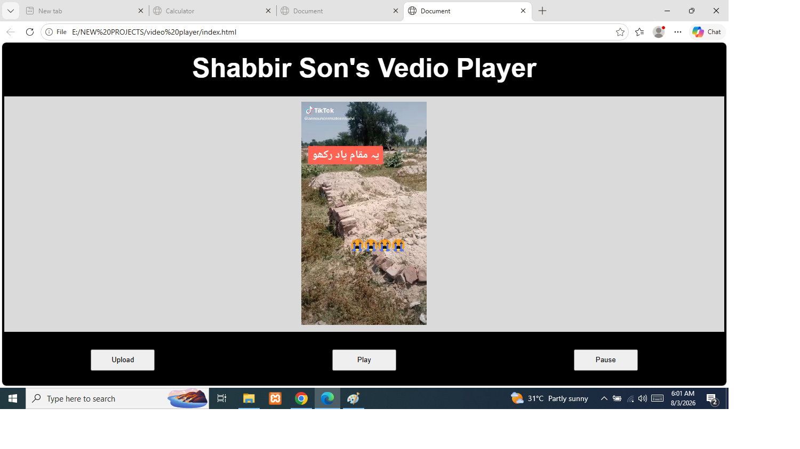

# Video Player

A responsive custom Video Player built using HTML5, CSS3, JavaScript, and Bootstrap 5. This project demonstrates how to create an interactive video player with custom controls and JavaScript-based functionality.

## Project Preview



## About The Project

This video player is a front-end portfolio project designed to provide a simple and responsive interface for playing videos directly in the browser.

The project uses the HTML5 `<video>` element together with JavaScript to control video playback and user interactions.

## Features

* Play button
* Pause button
* Upload video button
* Video file selection using JavaScript
* Custom video player interface
* JavaScript-based video controls
* Responsive design
* Bootstrap 5 layout
* Hover effects
* Works on desktop, tablet, and mobile devices
* No backend required

## Technologies Used

| Technology  | Purpose                                      |
| ----------- | -------------------------------------------- |
| HTML5       | Page structure and HTML5 video element       |
| CSS3        | Custom styling and video player design       |
| JavaScript  | Video controls and file upload functionality |
| Bootstrap 5 | Responsive layout and UI components          |

## Project Structure

```text
Video-Player/
│
├── index.html
├── style.css
├── script.js
├── screenshot.png
└── README.md
```

## How It Works

### Play Button

The Play button uses JavaScript to start video playback using the HTML5 video element.

### Pause Button

The Pause button stops the currently playing video using JavaScript.

### Upload Button

The Upload button allows the user to select a video file from their device. JavaScript reads the selected file and loads it into the video player.

The video can then be played directly in the browser without uploading it to a server.

## Responsive Design

The video player is designed to work across different screen sizes using Bootstrap 5 and responsive CSS.

It supports:

* Mobile devices
* Tablets
* Laptops
* Desktop computers

## User Interface

The interface is designed to be simple and easy to use. The player includes custom buttons for controlling video playback and an upload option for selecting local video files.

CSS hover effects provide visual feedback when interacting with the controls.

## What I Learned

Through this project, I practiced:

* Working with the HTML5 video element
* JavaScript DOM manipulation
* JavaScript event handling
* Handling file input with JavaScript
* Creating custom video controls
* Using Bootstrap 5 for responsive layouts
* Writing responsive CSS
* Creating interactive user interfaces


## Portfolio Project

This Video Player was created as a front-end portfolio project to demonstrate practical skills in HTML5, CSS3, JavaScript, and Bootstrap 5.

## License

This project is available for learning and portfolio purposes.
